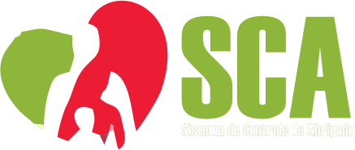

# Sistema de Gestão de Abrigados




Este é o primeiro projeto desenvolvido para a disciplina de **Aplicativos para Web** do curso de **Sistemas da Informação** da **Universidade Franciscana (UFN)**. O sistema foi criado utilizando **PHP Laravel** e tem como objetivo gerenciar abrigados em abrigos, oferecendo ferramentas para a gestão de pessoas, processos e dos próprios abrigados.

## Funcionalidades Principais

- **Gestão de Pessoas**: Controle completo sobre os dados dos funcionários, voluntários e outros colaboradores envolvidos na operação dos abrigos.
  
- **Gestão de Abrigados**: Cadastro e acompanhamento dos abrigados, incluindo informações pessoais, histórico de saúde, e alocação dentro do abrigo.

- **Gestão de Processos**: Organização e monitoramento de processos internos do abrigo, como distribuição de recursos, agendamento de atividades, e controle de entrada e saída de abrigados.

- **Relatórios**: Geração de relatórios detalhados para monitorar o estado dos abrigados, a eficiência dos processos, e o desempenho geral do abrigo.

## Requisitos

- PHP >= 8.0
- Composer
- Laravel >= 9.x
- MySQL ou PostgreSQL

## Instalação

1. Clone o repositório:

   ```bash
   git clone https://github.com/JonathanTeixeira09/Sistema-de-Controle-de-Abrigo.git
